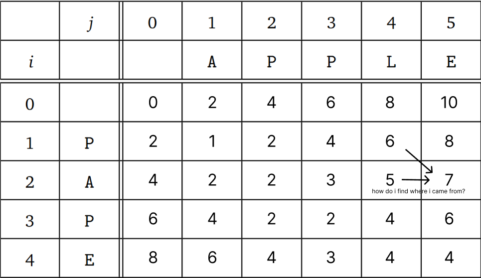

# 1


# 2



You find the sequence either by noting it down as you go, or by backtracking from the last cell to the first cell.

# 3

This problem can be solved using dynamic programming.

For each character in the string, a given character n can be either part of the longest palindrome, or not part of the longest palindrome.

If it is in the longest palindrome then, we can remove the first and last characters and recursively find the longest palindrome of the remaining string.

If it is not in the longest palindrome, then we can remove the character and recursively find the longest palindrome of the remaining string.

We can memoize the results of the recursive calls to avoid repeating the same work. We can use a 2D array to store the results of the recursive calls.

The array will have the length of the string on the x axis, and the starting index of the string on the y axis.

The base case is when the length of the string is 1, then the longest palindrome is the string itself.


```
LP(s) = 
{
LP(s[1:-1]) + 2 if s[0] == s[l-1]
max(LP(s[1:]),LP(s(:1)))
1               if s.length() == 1
}
```

```
LP(s){
    if(s.length == 1)
        return 1

    if(s[0] == s[s.length-1])
        return max(LP(s[1:]) LP(s[1:-1]))
    else 
        return LP(s[1:])
}
```
Memoization
```
LP(s){
    if(s.length == 1)
        return 1

    if(memo[s.length][trueIndex] != -1)
        return memo[s.length][trueIndex]

    if(s[0] == s[s.length-1])
        memo[s.length][trueIndex] = max(LP(s[1:]) LP(s[1:-1]))
    else 
        memo[s.length][trueIndex] = LP(s[1:])

    return memo[s.length][trueIndex]
}
```

badbba

[6,0] = addba = 3

[5,1] = max(ddb+2 ddba) = 3

---

[3,2] = db = 1

[2,3] = b = 1

[3,4] = 1

-----

[4,2] = dba = 1

[3,3] = ba = 1

[2,4] = a = 1

[1,5] = 1


# 4

# 5

## a

Set $x_4$ = 2, then the algorithm will choose to use the emp on the 4th element, and will have to skip the 3rd element which is optimal.

The algorithm will return 4, but the optimal solution is 5. with choosing the 3rd and 4th elements.

## b

for each element in array, either choose the element or skip it, then make 2d cache based on index and time since shooting.

then pick the max robots destroyed from shooting or skipping the element.

```
OPT(index, rechargeindex){

    int shot_robots = min(robots[index],recharge(rechargeindex)

    if(index == robots.length-1)
        return shot_robots
    

    return max(OPT(index-1,rechargeindex+1), OPT(index-1,1)+shot_robots))
}
```
cache
```
OPT(index, rechargeindex){
    
    int shot_robots = min(robots[index],recharge(rechargeindex)

    if(index == robots.length-1){
        cache[index][rechargeindex] = shot_robots
        return cache[index][rechargeindex]
    }
    
    cache[index][rechargeindex] = max(OPT(index-1,rechargeindex+1), OPT(index-1,1)+shot_robots))

    return cache[index][rechargeindex]
}
```


