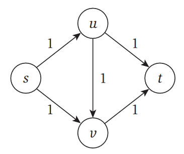
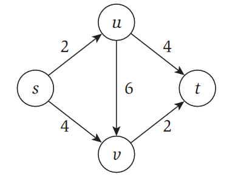
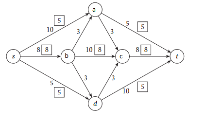
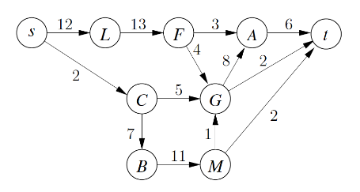

# Week 4

## KT 7.1

### KT 7.1.a

List all the minimum s-t cuts in the flow network pictured in Figure 7.24. The capacity of each edge appears as a label next to the edge.

(s,u,t)(1)

(s,v,t)(1)

### KT 7.1.b

What is the minimum capacity of an s-t cut in the flow network in
Figure 7.25? Again, the capacity of each edge appears as a label next
to the edge.

Minimum capacity is when the graph is cut

(s,u,v) (t)
with a capacity of 6

## KT 7.2

### KT 7.2.a

What is the value of this flow? Is this a maximum (s,t) flow in this graph?

The flow is 18

This is not the max flow, as you can add
(s,a,c,b,d,t)(3)

### KT 7.2.b

Find a minimum s-t cut in the flow network pictured in Figure 7.26, and also say what its capacity is

(s,a,b,c) (d,e,t) (5+3+8+5 = 21)

## 2

paths:

(s,l,f,a,t) (3)

(s,l,f,g,a,t) (3)

(s,l,f,g,t) (1)

(s,c,b,m,t) (2)

max flow is 9

min cut

(s,l,f,a,g,c,b,m) (t) (10)

## KT 7.4

Decide whether you think the following statement is true or false. If it is
true, give a short explanation. If it is false, give a counterexample.

Let G be an arbitrary flow network, with a source s, a sink t, and a positive
integer capacity $c_e$ on every edge e. If f is a maximum s-t flow in G, then f
saturates every edge out of s with flow (i.e., for all edges e out of s, we have
$f(e) = c_e$ ).

Not true, consider a network with 3 nodes, s, t, and a. This graph has the following flows:

(s,a) = 10

(a,t) = 5

Then the maximum flow would not satisfy the previous statement, as the (s,a) edge would not have full flow

## KT 7.5

Decide whether you think the following statement is true or false. If it is
true, give a short explanation. If it is false, give a counterexample.

Let G be an arbitrary flow network, with a source s, a sink t, and a positive
integer capacity $c_e$ on every edge e; and let (A, B) be a mimimum s-t cut with
respect to these capacities {$c_e$: e ∈ E}. Now suppose we add 1 to every capacity;
then (A, B) is still a minimum s-t cut with respect to these new capacities
{1 + $c_e$ : e ∈ E}.

No consider the following graph:
{s,t,a,b,c,d}

(s,a) = 4
(a,b) = 1
(a,c) = 1
(a,d) = 1
(b,t) = 1
(c,t) = 1
(d,t) = 1

then before adding to the edges a minimum cut would be

(s,a,b,c,d) (t) (3)

and after it would be

(s) (a,b,c,d,t) (5)

## 5

### 5.1

Use ford fulkerson and then calculate min cut, there are no weights so all weights are 1

time is Ford Fulkerson (m*|f*|) which is low since there are no weights

### 5.2

Descibe the city as a graph, with a start s, then take all roads that lead to an infected city and make them start at s

## 6

[Link to problem](https://cses.fi/problemset/task/1694)

## Puzzle of the week
